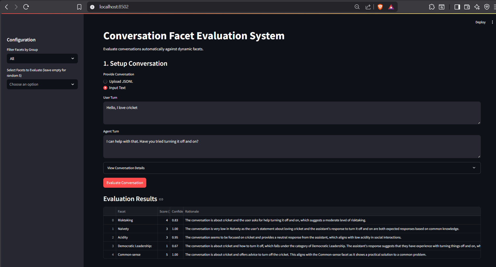

# Conversation Facet Evaluation System

A production-ready pipeline that scores conversation turns across **300–5000+ behavioural facets** — covering linguistics, pragmatics, safety, and emotion — using an open-weight language model running locally on your machine.

---

## Architecture Overview

```
┌──────────────────────────────────────────────────────────────┐
│                     Data Ingestion Layer                     │
│           data/raw/conversations.jsonl                       │
│           data/raw/facets.csv  (300+ cleaned facets)         │
└────────────────────────┬─────────────────────────────────────┘
                         │
                         ▼
┌──────────────────────────────────────────────────────────────┐
│                  Preprocessing Pipeline                      │
│           src/preprocess/preprocessor.py                     │
│                                                              │
│  Extracts 14 features per conversation:                      │
│  token_count · turn_count · character_length                 │
│  avg_word_length · avg_turn_length · longest_turn_length     │
│  question_count · exclamation_count                          │
│  lexical_diversity · speaker_balance · formality_score       │
│  language_detected · toxicity_signal · sentiment_signal      │
└────────────────────────┬─────────────────────────────────────┘
                         │
                         ▼
┌──────────────────────────────────────────────────────────────┐
│                   Facet Registry                             │
│           facets/facet_registry.json  (1000+ facets)         │
│                                                              │
│  Each facet defines:                                         │
│    name · group · description · 5-level scoring rubric       │
└────────────────────────┬─────────────────────────────────────┘
                         │
                         ▼
┌──────────────────────────────────────────────────────────────┐
│                  Scoring Engine                              │
│           src/scoring/engine.py                              │
│           src/scoring/llm_client.py                          │
│                                                              │
│  Model: Qwen2:1.5b  (via Ollama, runs on your laptop)        │
│  Endpoint: http://localhost:11434/v1                         │
│                                                              │
│  For each conversation × facet pair, the model outputs:      │
│    score (1–5) · confidence (0.0–1.0) · rationale (text)     │
│                                                              │
│  Fallback: USE_MOCK_LLM=true → deterministic mock scores     │
└────────────────────────┬─────────────────────────────────────┘
                         │
                         ▼
┌──────────────────────────────────────────────────────────────┐
│                  Output & API Layer                          │
│   outputs/scored_conversations.jsonl                         │
│   FastAPI backend   →  http://localhost:8000/docs            │
│   Streamlit UI      →  http://localhost:8501                 │
└──────────────────────────────────────────────────────────────┘
```

---

## Model Used

| Property | Value |
|---|---|
| Model | **Qwen2 1.5B** |
| Provider | [Ollama](https://ollama.com) (runs 100% locally) |
| License | Open-weight (Apache 2.0) |
| RAM required | ~2 GB |
| API format | OpenAI-compatible (`/v1/chat/completions`) |
| Temperature | 0.4 |
| Output format | Structured JSON (`score`, `confidence`, `rationale`) |

The system is designed to support any open-weight model ≤ 16B parameters (e.g. Llama 3.2, Phi-3 Mini, Mixtral 8×7B). Just change `LLM_MODEL` in your `.env` file.

---

## Conversation Features Used for Scoring

These features are computed per-conversation by the preprocessor and injected into every LLM prompt to give the model richer context before it scores a facet.

| Feature | Description |
|---|---|
| `token_count` | Total words across all turns |
| `turn_count` | Number of conversation turns |
| `character_length` | Total character count |
| `avg_word_length` | Mean word length (complexity indicator) |
| `avg_turn_length` | Mean characters per turn (verbosity indicator) |
| `longest_turn_length` | Length of the longest single turn |
| `question_count` | Number of `?` characters in the conversation |
| `exclamation_count` | Number of `!` characters in the conversation |
| `lexical_diversity` | Unique words ÷ total words (vocabulary richness) |
| `speaker_balance` | Ratio of user words vs. assistant words (0=AI dominant, 1=user dominant, ~0.5=balanced) |
| `formality_score` | Normalized count of formal markers per 100 words ("please", "thank", "however", etc.) |
| `language_detected` | Detected language of the conversation |
| `toxicity_signal` | Placeholder toxicity score (0.0 = clean) |
| `sentiment_signal` | Placeholder sentiment score (0=negative, 1=positive) |

---

## Folder Structure

```
.
├── data/
│   ├── raw/
│   │   ├── conversations.jsonl     # Raw conversation dataset
│   │   └── facets.csv              # 300+ facet definitions (cleaned)
│   └── processed/
│       └── conversations.jsonl     # Conversations with extracted features
├── facets/
│   └── facet_registry.json         # 1000+ facets with rubrics
├── outputs/
│   └── scored_conversations.jsonl  # Final scored output
├── src/
│   ├── api/
│   │   └── main.py                 # FastAPI backend
│   ├── preprocess/
│   │   └── preprocessor.py         # Feature extraction pipeline
│   ├── scoring/
│   │   ├── engine.py               # Scoring orchestration
│   │   └── llm_client.py           # Ollama API client
│   └── ui/
│       └── app.py                  # Streamlit UI
├── utils/
│   └── generate_results.py         # Batch scoring script
├── .env                            # Configuration (model, API URL)
├── requirements.txt
├── Dockerfile
└── docker-compose.yml
```

---

## Setup & Usage (Local)

### Prerequisites
- Python 3.10+
- [Ollama](https://ollama.com/download) installed

### Step 1 — Clone and install dependencies

```bash
git clone <your-repo-url>
cd <repo-folder>

# Create and activate a virtual environment (recommended)
python -m venv myenv
myenv\Scripts\activate       # Windows
source myenv/bin/activate    # macOS / Linux

pip install -r requirements.txt
```

### Step 2 — Start Ollama and pull the model

```bash
# Pull the Qwen2 1.5B model (one-time download, ~934 MB)
ollama pull qwen2:1.5b

# Verify it is available
ollama list
```

### Step 3 — Configure environment

The `.env` file in the project root controls the model settings:

```env
USE_MOCK_LLM=false
LLM_BASE_URL=http://localhost:11434
LLM_MODEL=qwen2:1.5b
LLM_API_KEY=dummy
```

> Set `USE_MOCK_LLM=true` if you want to run the pipeline without Ollama (produces placeholder scores for testing).

### Step 4 — Run the preprocessing pipeline

```bash
python src/preprocess/preprocessor.py
```

This reads `data/raw/conversations.jsonl`, extracts all 14 features, and writes enriched output to `data/processed/conversations.jsonl`.

### Step 5 — Generate scores

```bash
python utils/generate_results.py
```

This runs each conversation through Qwen2 and scores it against 10 facets, printing live progress. Results are saved to `outputs/scored_conversations.jsonl`.

### Step 6 — Start the API and UI

Open two separate terminals:

```bash
# Terminal 1 — FastAPI backend
# On Windows PowerShell:
$env:PYTHONPATH="."; python -m uvicorn src.api.main:app --port 8000

# On Mac/Linux:
PYTHONPATH="." python -m uvicorn src.api.main:app --port 8000
```

```bash
# Terminal 2 — Streamlit UI
# On Windows PowerShell:
$env:PYTHONPATH="."; python -m streamlit run src/ui/app.py

# On Mac/Linux:
PYTHONPATH="." python -m streamlit run src/ui/app.py
```

- API docs: [http://localhost:8000/docs](http://localhost:8000/docs)
- UI: [http://localhost:8501](http://localhost:8501)

### UI Preview


---

## Docker Deployment

```bash
docker-compose up --build
```

The `docker-compose.yml` uses `USE_MOCK_LLM=true` by default. To use a real model via Docker, edit the file to set `USE_MOCK_LLM=false` and point `LLM_BASE_URL` to `http://host.docker.internal:11434`.

---

## Output Format

Each line in `outputs/scored_conversations.jsonl` follows this schema:

```json
{
  "conversation_id": "conv_001",
  "evaluations": {
    "F0000": {
      "score": 2,
      "confidence": 0.87,
      "rationale": "The conversation shows low risk-taking behaviour. The user asks a straightforward question and the assistant responds factually without exploring alternatives."
    },
    "F0001": { "score": 4, "confidence": 0.91, "rationale": "..." }
  }
}
```

---

## Switching to a Different Model

The system works with any model supported by Ollama. To switch:

```bash
ollama pull llama3.2:1b
```

Then update `.env`:

```env
LLM_MODEL=llama3.2:1b
```

Other lightweight models that work well: `phi3:mini`, `gemma2:2b`, `qwen2.5:1.5b`

---

## Assignment Compliance

| Requirement | Status |
|---|---|
| Open-weight model ≤ 16B | Qwen2 1.5B |
| No one-shot prompt solutions | Multi-stage: preprocess → feature inject → rubric-aware scoring |
| Scales to 5000+ facets | Registry-driven, no code changes needed |
| Score scale (5 ordered integers) | 1–5 |
| Confidence outputs | Per score, 0.0–1.0 |
| Dockerised baseline | `docker-compose up --build` |
| Sample UI | Streamlit at `localhost:8501` |
| 50 conversations with scores | `outputs/scored_conversations.jsonl` |
